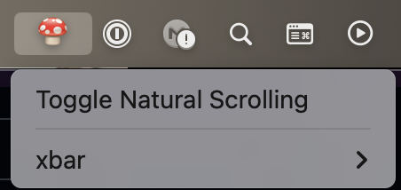

# macos-natural-scrolling

> Toggles natural scrolling using `osascript` which means it is MacOS only ⚠️



Installation:

```bash
$ cargo install --git https://github.com/pebaz/macos-natural-scrolling
```

For convenience, use this [Xbar]() script to put a clickable icon in the menu
bar:

```bash
#!/usr/bin/env bash

export PATH="$HOME/.cargo/bin:$PATH"

echo ':mushroom:'  # More Emojis: https://gist.github.com/rxaviers/7360908
echo '---'
echo "Toggle Natural Scrolling | shell='$(which macos-natural-scrolling)'"
```

Put the Xbar script in `~/Library/Application\ Support/xbar/plugins` and don't
forget to make it executable with `chmod +x toggle-natural-scrolling.sh`.

For convenience, this crate adds a CLI command to do this automatically:

```bash
$ macos-natural-scrolling install
```
